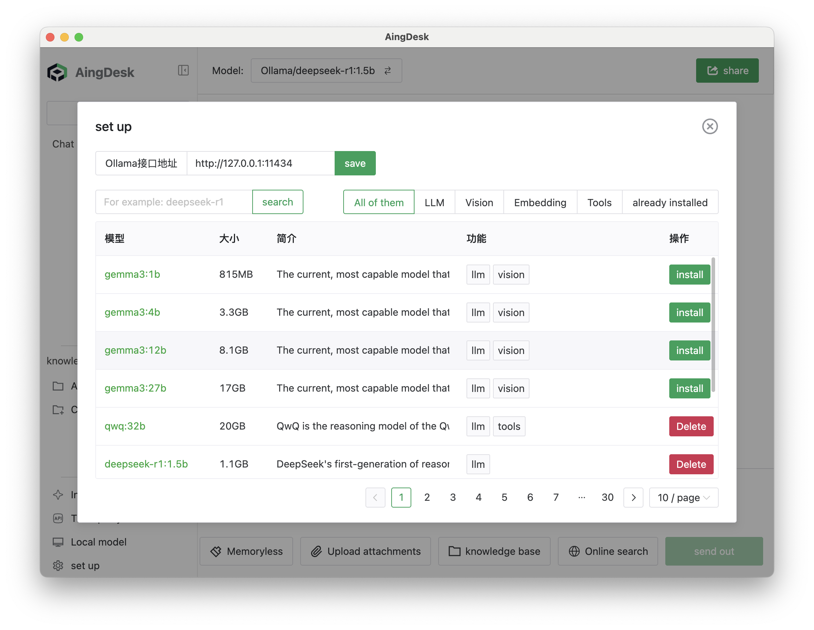
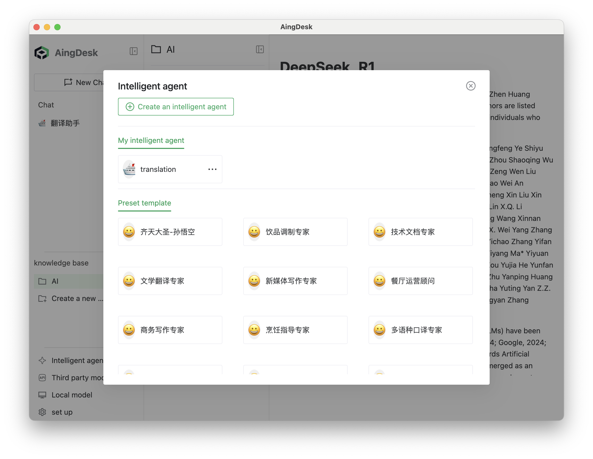
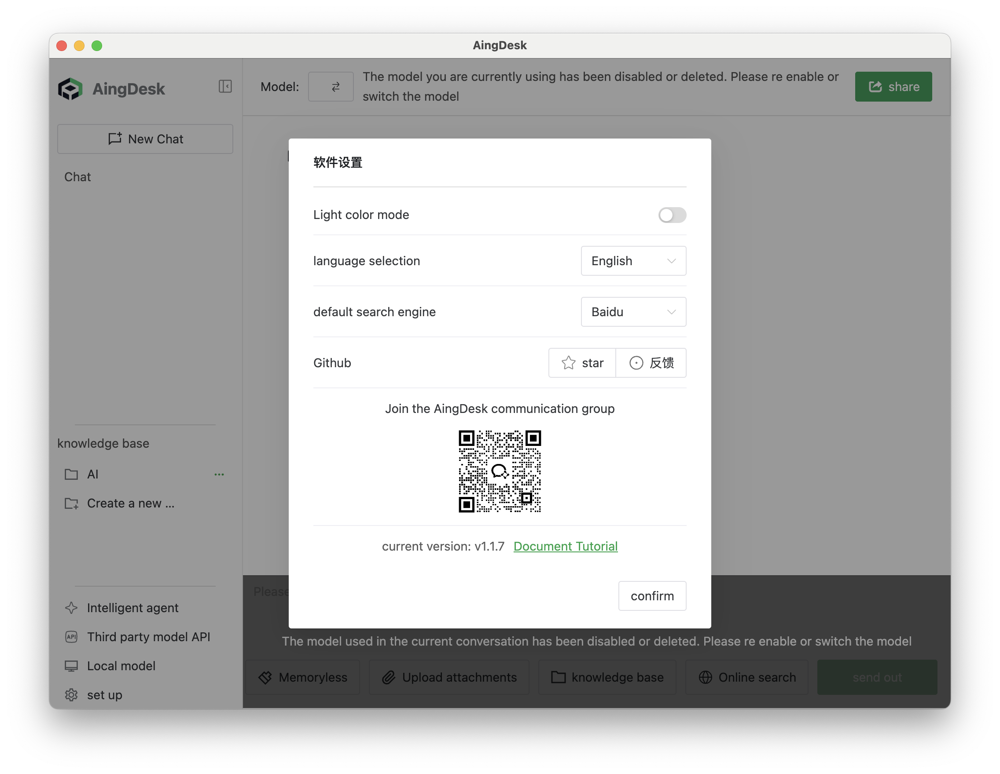

# AingDesk


[简体中文](README.zh_cn.md) | [Official Website](https://www.aingdesk.com/) | [Documentation](https://docs.aingdesk.com/)

AingDesk是一款简单好用的AI助手，支持知识库、模型API、分享、联网搜索、智能体，它还在飞快成长中。

AingDesk is an easy-to-use AI assistant that supports knowledge bases, model APIs, sharing, web search, and intelligent agents. It's rapidly growing and improving.

## 🚀 One-sentence Introduction  

A user-friendly AI assistant software that supports local AI models, APIs, and knowledge base setup.

## ✅ Core Features  

- One-click deployment of local AI models and mainstream model APIs

- Local knowledge base

- Intelligent agent creation

  
- Can be shared online for others to use


- Supports web search


- Supports server-side deployment 
- Simultaneous conversations with multiple models in a single session (coming soon)  

## ✨ Product Highlights  
- Simple and easy to use, beginner-friendly for AI newcomers  

## 📥 Quick Installation

### Client Version（MacOS, Windows） 

- [Download from official website](https://www.aingdesk.com/)   
- [Download from CNB](https://cnb.cool/aingdesk/AingDesk/-/releases/)  
- [Download from Github](https://github.com/aingdesk/AingDesk/releases)  

### Server Version

#### Docker Run
```bash 
docker run -d \
  --name node \
  -v $(pwd)/data:/aingdesk/data \
  -v $(pwd)/uploads:/aingdesk/uploads \
  -v $(pwd)/logs:/aingdesk/logs \
  -p 7071:7071 \
  -w /aingdesk \
  aingdesk/aingdesk
```

#### Docker Compose
```bash
mkdir -p aingdesk
cd aingdesk
wget https://cnb.cool/aingdesk/AingDesk/-/git/raw/server/docker-compose.yml
# Run
docker compose up -d
# or
docker-compose up -d
``` 

## Star History

[](https://www.star-history.com/#aingdesk/aingdesk&Date)